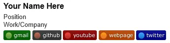

# bidge 🧩

**bidge** is a tiny collection of label-badges  
designed for READMEs, email signatures, and lightweight documentation.

These are **not brand badges** — just simple, human-friendly labels  
that *look* like badges.

---

## Why bidge?

- 📧 Email-safe (PNG, small height)
- 🧠 No company logos
- 🧩 Emoji + text = universal meaning
- 🧪 Generated via shields.io, stored as static assets

---

## Sample — socials

| label     | Darkgreen | Darkblue | Darkred | `#333` | `#b40` |
|-----------|-----------|----------|---------|--------|--------|
| `github`  |  |  |  |  |  |
| `gmail`   |    |    |      |    |  |
| `facebook`|  |  |  |  |  |
| `youtube` |  |  |  |  |  |
| `webpage` |  |  |  |  |  |
| `twitter` |  |  |  |  |  |
| `whatsapp` |  |  |  |  |  |
| `instagram` |  |  |  |  |  |
| `tiktok` |  |  |  |  |  |
| `linkedin` |  |  |  |  |  |
| `pinterest` |  |  |  |  |  |
| `reddit` |  |  |  |  |  |

---

## Sample — misc.

| label        | Darkgreen | Darkblue | Darkred | `#333` | `#b40` |
|--------------|-----------|----------|---------|--------|--------|
| `copyright`  |  |  |  |  |  |
| `about` |  |  |  |  |  |
| `credits` |  |  |  |  |  |
| `contact` |  |  |  |  |  |

---

## Sample result

## About

These **bidges** (little badges) are generated using  
[shields.io](https://shields.io) and saved as static PNG files.

They are intended for:
- email signatures
- documentation
- READMEs
- offline or cached contexts

---

## Disclaimer

Platform names are used for identification purposes only.  
All trademarks belong to their respective owners.

---

## Status

🚧 Under development
